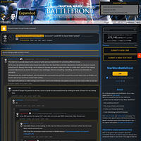

# ↔️ Collapsible Sidebar for Old Reddit

   

A lightweight UserScript that adds a toggle button to the sidebar on Old Reddit, allowing you to hide it for a cleaner reading experience or expand it when needed.

## ✨ Features

* **Toggle Button:** Adds a discreet `<<` / `>>` button to the side of the content.
* **State Memory:** Remembers if you left the sidebar open or closed (uses LocalStorage).
* **Responsive:** Content expands to fill the empty space when the sidebar is hidden.
* **Minimalist:** No heavy frameworks, pure vanilla JS.

## 📥 Installation

1. Install a Userscript manager:
    * **Chrome/Edge:** [Tampermonkey](https://www.tampermonkey.net/) or [Violentmonkey](https://violentmonkey.github.io/)
    * **Firefox:** [Violentmonkey](https://addons.mozilla.org/en-US/firefox/addon/violentmonkey/) or [Tampermonkey](https://addons.mozilla.org/en-US/firefox/addon/tampermonkey/)
2. Click the **Install Script** button at the top of this page, or install it directly from [GreasyFork](https://greasyfork.org/scripts/TU_ID_AQUI).
